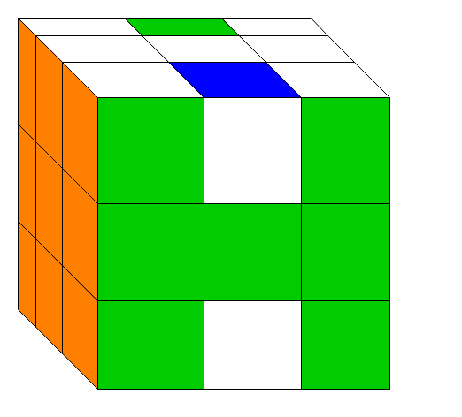

# OpenSource-Rubik-cube
ルービックキューブとは一般的に難しいと思われているが，実際に真面目に解いてみると簡単であることがわかる．
確かに，任意の状態から任意の状態にするのは脳内でかなりの計算量またはパターンの記憶量が必要になるが，目的の状態が固定されていればそれほど大きな問題ではない．
具体的には，任意の状態から順に制約を満たす状態へと変化させていってすべての面が一色である制約を満たす状態に持っていく．

ルービックキューブを解く方針は無数にあるが，最も有名なのは一段ずつ揃えていくLayer By Layer (LBL法)である．この方法は自分で解き方を見つける場合にはおすすめできない．
実際に自分もやってみたのでわかるのだが，最後の段の構築が難しい．ここでは，自分が見つけた現実的にルービックキューブを解ける方法を説明する．
ここでの解く方針は，ある面と反対側の面 (二つの面) の完全一面を同時に完成させ，残ったキューブをそろえる方法である．この方針だと，最初の難易度が上昇するがその分最後の難易度が減少する．

# 解法
1. 上面のコーナーキューブを正しい向きで配置する．
2. 上面のコーナーキューブをキープしながら下面のコーナーキューブを揃える．
3. 上面と下面のエッジキューブを同時に埋めていき，上面と下面の完全一面を同時に作る．
4. 中段のエッジキューブの位置を180度回転のみであるべき位置に持っていく (この時点で残す問題は中段のエッジキューブの向きだけ)．
5. 4で完成しなかったら適当に崩して1から4を再度実行する (具体的な方針がない場合はエッジキューブの修正だけで済むように崩す)．崩す前の状態，崩し手順，3と4を実現した手順をメモする．
6. 5で崩す前の状態と何が変わったかを確認する．この変化が「崩し手順，1から4を実現した手順」という一連の手順によって起きる変化となる．5を繰り返し行い，十分な種類の変化を起こす手順を得る．
7. 6で得られた手順を組み合わせて完成させる．**誰でも確実にルービックキューブが解ける** 

LBL法の方針をとらず，ここでの方針の工夫のおかげで5ではエッジキューブの修正だけですむような崩し方ができる．LBL法でも同じようにエッジキューブの修正だけまで持っていけるが，小手数で戻せるような崩し方が見つかりにくい．これは，多くの面が完成していることによって小手数で戻せるように崩すのが難しいためである．ここでの方法であれば，2面しか完成していない状態で最後の向きの修正に取り組むことができ，崩しても小手数で復元できる．

# 用語
## キューブの種類
- センターキューブ: 一面のセンターにあるキューブ．1面しか持たず，どう動かしてもセンターキューブ同士の相対的位置関係は変化しない．6個存在する．
- コーナーキューブ: 一面の角にあるキューブ．3面を持ち，正しい位置は各面のセンターキューブと同じ色になる位置．8個存在する．
- エッジキューブ: 一面の辺にあるキューブ．2面を持ち，正しい位置は各面のセンターキューブと同じ色になる位置．12個存在する．

## 上面・下面・中段
ルービックキューブを解こうとする時に一番大事なことは「同じことを考えないこと」である．
ルービックキューブではセンターキューブの相対的位置は変わらないので，これを利用して認識の座標軸を構築する．
任意のセンターキューブを上面として定め，対となる面を下面，上面と下面の構成に関わらないその他のキューブを中段とする．

## 完全一面
ある一面がセンターキューブと同じ一色になっており，かつ，エッジキューブ・コーナーキューブのすべての面がその面のセンターキューブと同じ色であること．

# ここまで
ここまでの説明でルービックキューブを自分で解くのに発見のハードルが高いエッセンスはすべて示してある．
