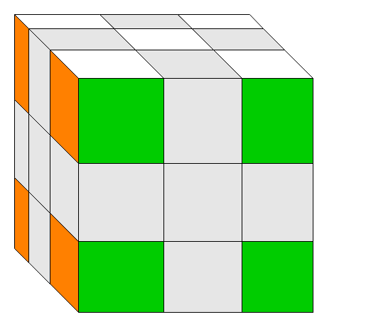

# OpenSource-Rubik-cube
ルービックキューブとは一般的に難しいと思われているが，実際に真面目に解いてみると簡単であることがわかる．
確かに，任意の状態から任意の状態にするのは脳内でかなりの計算量またはパターンの記憶量が必要になるが，目的の状態が固定されていればそれほど大きな問題ではない．
具体的には，任意の状態から順に制約を満たす状態へと変化させていってすべての面が一色である制約を満たす状態に持っていく．

ルービックキューブを解く方針は無数にあるが，最も有名なのは一段ずつ揃えていくLayer By Layer (LBL法)である．この方法は自分で解き方を見つける場合にはおすすめできない．
実際に自分もやってみたのでわかるのだが，最後の段の構築が難しい．ここでは，自分が見つけた現実的にルービックキューブを解ける方法を説明する．
ここでの解く方針は，ある面と反対側の面 (二つの面) の完全一面を同時に完成させ，残ったキューブをそろえる方法である．この方針だと，最初の難易度が上昇するがその分最後の難易度が減少する．

# 解法の指針
1. 上面のコーナーキューブを正しい向きで配置する．
2. 上面のコーナーキューブをキープしながら下面のコーナーキューブを揃える．
3. 上面と下面のエッジキューブを同時に埋めていき，上面と下面の完全一面を同時に作る．
4. 中段のエッジキューブの位置を180度回転のみであるべき位置に持っていく (この時点で残す問題は中段のエッジキューブの向きだけ)．
5. 4で完成しなかったら適当に崩して1から4を再度実行する (具体的な方針がない場合はエッジキューブの修正だけで済むように崩す)．崩す前の状態，崩し手順，3と4を実現した手順をメモする．
6. 5で崩す前の状態と何が変わったかを確認する．この変化が「崩し手順，1から4を実現した手順」という一連の手順によって起きる変化となる．5を繰り返し行い，十分な種類の変化を起こす手順を得る．
7. 6で得られた手順を組み合わせて完成させる．**誰でも確実に**ルービックキューブが解ける． 

LBL法の方針をとらず，ここでの方針の工夫のおかげで5ではエッジキューブの修正だけですむような崩し方ができる．LBL法でも最後はエッジキューブだけの修正になるが，小手数で戻せるような崩し方が見つからない状態となる．これは，多くの面が完成していることによって，意図して小手数で戻せるように崩すのが難しいためである．ここでの方法であれば，2面しか完成していない状態で最後の向きの修正に取り組むことができ，崩しても小手数で復元できる．

# 用語
## キューブの種類
- センターキューブ: 一面のセンターにあるキューブ．1面しか持たず，どう動かしてもセンターキューブ同士の相対的位置関係は変化しない．6個存在する．
- コーナーキューブ: 一面の角にあるキューブ．3面を持ち，正しい位置は各面のセンターキューブと同じ色になる位置．8個存在する．
- エッジキューブ: 一面の辺にあるキューブ．2面を持ち，正しい位置は各面のセンターキューブと同じ色になる位置．12個存在する．

## 上面・下面・中段
ルービックキューブを解こうとする時に一番大事なことは「同じことを考えないこと」である．
ルービックキューブではセンターキューブの相対的位置は変わらないので，これを利用して認識の座標軸を構築する．
任意のセンターキューブを上面として定め，対となる面を下面，上面と下面の構成に関わらないその他のキューブを中段とする．

## 完全一面
ある一面がセンターキューブと同じ一色になっており，かつ，エッジキューブ・コーナーキューブのすべての面がその面のセンターキューブと同じ色であること．

# ここまで
ここまでの説明でルービックキューブを自分で解くのに発見のハードルが高いエッセンスはすべて示してある．

# ここから
上記のルービックキューブの解法の自力発見のエッセンスを踏まえて具体的な解法を示す．ここでの解法はルービックキューブの具体的な解き方の一例を示しているにすぎず，自分でアレンジしたり以降の解法を見ずに自力でルービックキューブを解いてみたりしてほしい．

# ルービックキューブの解法の具体例
ここからの説明では，次の色の組み合わせを想定して説明する．

必要な部分の色は一意に定まるようにサンプル画像を調整しているので，適宜脳内で補完してほしい．この補完能力は，実際にルービックキューブを回す際にも，これができると非常に効率よく状態を把握できるので意識的に練習することをお勧めする．もちろんそれができなくても，時間をかければ必ずできる．

ここからは，白を`上面`，黄色を`下面`として，ここで説明した「ルービックキューブの解法の指針」を基にした具体的な解法を説明する．難易度の山場は「2\~3」と「4\~7」の手順である．「4\~7」は4まで行けることができた時点で試したことがないパターンをひたすら試せばできるので，真に難しいのは「2\~3」である．

## 回し方の記法
ここではルービックキューブの回し方の記法としてよく使われる回転記号の列によって示す．回転記号は回す面を表す記号 (R, L, F, B, U, D)と回転量を表す数字で表現される．例えば， `R2` と書いてあれば右面を180度 (2回)回転させるという意味になる．また，回転量を表す数字の代わりに `'` が用いられる場合もある．ここでは， `'` を用いて `<回転面>(2|'|ε)` という形式で1つの回転を記述する．つまり，右面を90度回すのは `R` ，180度回すのは `R2` ，270度 (90度逆回転させるのに等しい)回すのは `R'` というように表記でき，右面の回転は網羅できている．

### 回転面記号と回転方向
回転面記号と回転面との対応は以下のとおりである．
- R : 右面
- L : 左面
- F : 手前面
- B : 背面
- U : 上面
- D : 下面

この表記における回転方向は，その面を正面にして時計回りが順方向として， `'`で表現される逆方向はその順方向の逆である．RとL，FとB，UとDの回転方向は逆になるので注意していただきたい．

また，便宜上センターキューブを含む真ん中の列を回すという意味の記号 `M` を用いる．`M` は `R L'` を行ってキューブ自体を手前に向かって90度回転させることと同じである．その他回転面の記号と同じように `M'` (`R' L` を行って90度奥に向かってキューブを回転)と `M2` (`R2 L2` を行ってキューブを180度手前に向かって回転)を使って回転量を示す．

## Step 1
ここでは任意のコーナーキューブを任意の場所に入れるために次の2種類の手法を用いる．いずれか一方だけでもゴールにたどり着くことは可能である．

### ゴール (次の状態に行く条件)

### 使用するルール
#### 状態と手順
Step 1の基礎である側面にコーナーキューブの黄色が来ている場合である．例えば，2通りあるがどちらもシンプルで便利なので両方示す．これらの手順は下段の他のコーナーキューブの向きと位置に影響を及ぼさず，上段のコーナーキューブを任意の下段のコーナーキューブの位置にいれるものである．

ここでは，説明を簡略化するため，下段の入れたいキューブの位置の直上にそのキューブがあるものとする．

入れたいコーナーキューブが前面に黄色を向けている場合
```
U R U' R'
または
F' U' F
```

入れたいコーナーキューブが右面に黄色を向けている場合
```
U' F' U F
または
R U R'
```

入れたいコーナーキューブが上面に黄色を向けている場合
```
R U' R' F' U2 F
または
R U' R' U2 R U R'
```
上記はFから始めることも可能
```
F U F' R' U2 R
または
F U F' U2 F U F'
```

## Step 2
状態1のゴール状態を満たしているとき，以下のような状態が考えられる．


### ゴール例 (次の状態に行く条件)
ここではコーナーキューブの向きは問わないので例を示す．


### 使用するルール
#### 状態と手順
上面のコーナーキューブの位置を入れ替える方法を示す．
手前二つのコーナーキューブを入れ替える．
```
F U' R U' R' U2 F' U F U' F' U'
```
意味
```
(F U' (R U' R') U2 F') U (F U' F') U'
```

## Step 3

### ゴール (次の状態に行く条件)


### 使用するルール
#### 状態と手順
上面のコーナーキューブの位置を変えずに向きだけを変える方法を示す．以下の手順によって上面右奥のコーナーキューブの向きが変わらず，他3つのキューブは時計回りに向きを変える．
```
R U2 R' U' R U' R' U2
```

ほとんどのケースではこの手順1回では完成しないため，キューブを持っている向きを変えたり2回行ったりして，右奥のキューブが変化しないという条件をうまく使ってゴールの状態まで持っていく必要がある．

## Step 4
Step 4はコツを抑えればどの状態よりも簡単になる．作業の概念的な説明としては，黄色のエッジキューブと白のエッジキューブのペアを2段目で作って，上面と下面に同時に設置するという作業を行う．
### ゴール (次の状態に行く条件)
ここでは，見易さのため上面 (白)を左面に持ってきています．


### 使用するルール
#### 状態と手順
ここでの作業で難しいと思われる手順が考えつかないのでひとまずは書かないでおくことにする．臨機応変に2段目でペアを作って上面と下面の色を同時に揃えていく作業を行う．

## Step 5

### ゴール


### 使用するルール
#### 状態と手順
下面のエッジキューブ2つの向きを反転させる手順を示す．
```
M D M D M D2 M' D M' D M' D2
```

ここでの手順は [`解法の指針`](https://github.com/dousu/OpenSource-Rubik-cube#%E8%A7%A3%E6%B3%95) に基づいて独自に導出したものであるが，以下のリンクの手順と本質的には一緒であるように見える (リンク先で示されている手順は上段の2つのエッジキューブの向きを反転させており，ここで示す手順のDをUに置き換えるだけで同じ手順になるため)．

[Rubik's Cube/Rubik's Maneuver - Wikiversity](https://en.wikiversity.org/wiki/Rubik%27s_Cube/Rubik%27s_Maneuver)

ここで重要なのが，この手順が [`解決の指針`](https://github.com/dousu/OpenSource-Rubik-cube#%E8%A7%A3%E6%B3%95)によって導出されたものであるということである． [`解決の指針`](https://github.com/dousu/OpenSource-Rubik-cube#%E8%A7%A3%E6%B3%95)さえカバーしておけばルービックキューブは自分ひとりの力で完成させられる確度を具体的な手法を示すことで一定量担保するというのがここでの解説の目的である．そのため，十分に練られた手順と本質的に同じ手順を出せる[`解決の指針`](https://github.com/dousu/OpenSource-Rubik-cube#%E8%A7%A3%E6%B3%95)の優秀さを示すものとなっている．
